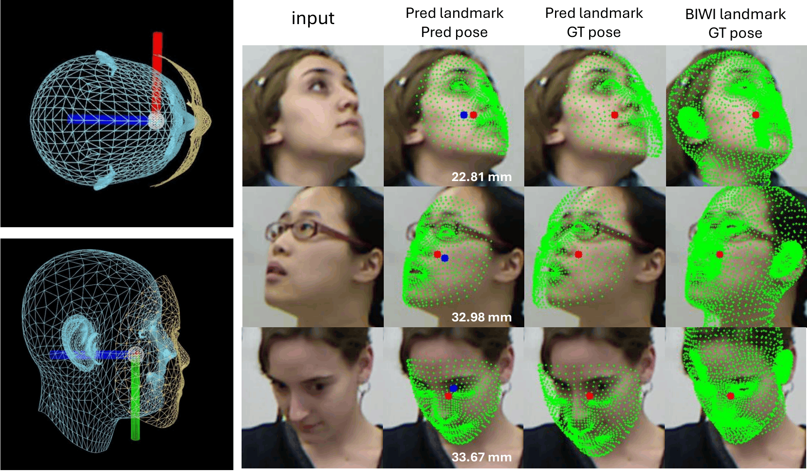
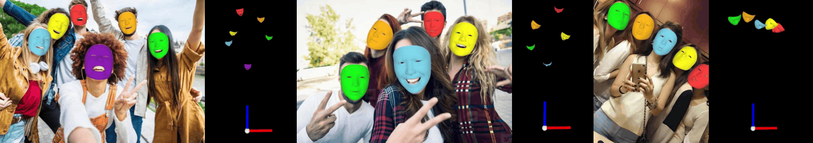
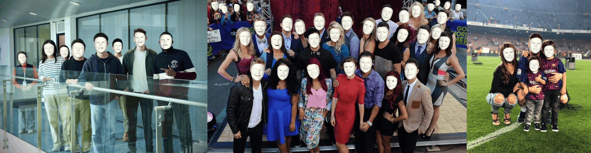
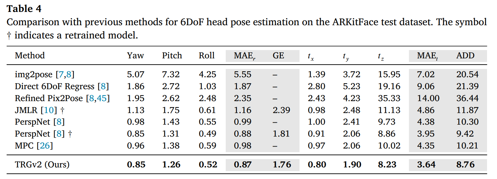
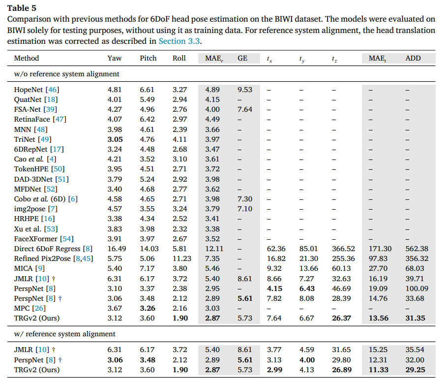
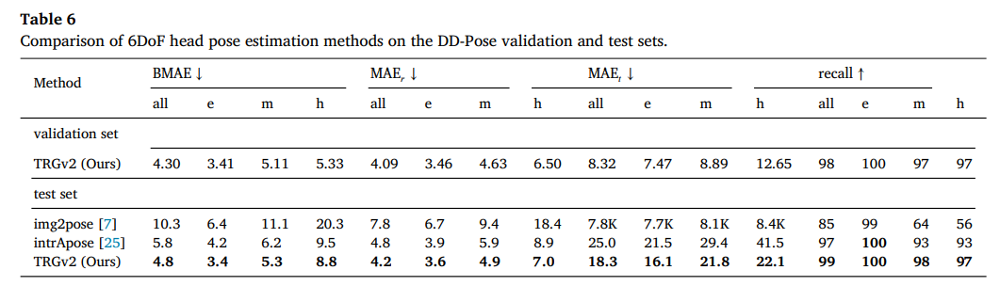

# [PR'26] TRGv2 (Translation, Rotation, and face Geometry network)  
  
- This is the official PyTorch implementation of "Bidirectional regression for monocular 6dof head pose estimation and reference system alignment." (PR 2026)  

- This work is extension version of TRG (ECCV 2024)
  
- TRGv2 is a lightweight version of TRG that achieves comparable performance on ARKitFace and BIWI while maintaining a more efficient architecture.

- 💪 One of the primary contributions of this research is the proposal of a **<u>reference system alignment method</u>**. Our reference system alignment approach enhances the reliability of translation estimation performance evaluation during cross-evaluation. For further details, please refer to the [paper (online)](https://www.sciencedirect.com/science/article/pii/S0031320326005510).
  
  
  
  
  

  
 
## Overview  
Precise six-degree-of-freedom (6DoF) head pose estimation is crucial for safety-critical applications and human-computer interaction scenarios, yet existing monocular methods still struggle with robust pose estimation. We revisit this problem by introducing TRGv2, a lightweight extension of our previous Translation, Rotation, and Geometry (TRG) network, which explicitly models the bidirectional interaction between facial geometry and head pose. TRGv2 jointly infers facial landmarks and 6DoF pose through an iterative refinement loop with landmark-to-image projection, ensuring metric consistency among face size, rotation, and depth. To further improve generalization to out-of-distribution data, TRGv2 regresses correction parameters instead of directly predicting translation, combining them with a pinhole camera model for analytic depth estimation. In addition, we identify a previously overlooked source of bias in cross-dataset evaluations due to inconsistent head center definitions across different datasets. To address this, we propose a reference system alignment strategy that, given the availability of 3D face geometry labels, quantifies and corrects translation bias to enable fair comparisons across datasets. Extensive experiments on ARKitFace, BIWI, and the challenging DD-Pose benchmarks demonstrate that TRGv2 outperforms state-of-the-art methods in both accuracy and efficiency.

## Installation  
Please check [Installation.md](./docs/install.md) for more information.  
  
## How to align reference system  
We provide guidelines to run reference system alignment. 

Please check [rsa.md](./docs/reference_system_alignment.md) for more information.

## Demo  
We provide guidelines to run end-to-end inference on test video.  
  
Please check [Demo.md](./docs/demo.md) for more information.  
  
## Download  
We provide guidelines for the dataset, pretrained weights, and additional data.  
Please check [Download.md](./docs/download.md) for more information.  
  
## Experiments  
We provide guidelines to train and evaluate our model.   
  
Please check [Experiments.md](./docs/experiments.md) for more information.  
  
## Results  
This repository provides several experimental results:  
  
  


  
## Acknowledgement  
This work was partly supported by Institute of Information 
& Communications Technology Planning 
& Evaluation (IITP) grant funded by the Korea government (MSIT) (No. RS-2023-00219700, Development of FACS-compatible facial expression style transfer technology for digital human, 80%), 
National Research Foundation of Korea (NRF) grant funded by the Korea government (MSIT) (No. NRF-2022R1F1A1066170, Physically valid 3D human motion reconstruction from multi-view videos, 10%), Basic Science Research Program through the National Research Foundation of Korea (NRF) funded by the Ministry of Education (No. RS-2025-25435513, 10%), and the research grant of Kwangwoon University in 2024.

## License
This project is licensed under the GNU General Public License v3.0.
See the [LICENSE](LICENSE) file for details.


## Citation  
If you find our work useful for your research, please consider citing our paper:  
  
````BibTeX  
@Article{chun2026trgv2,
    title = {Bidirectional regression for monocular 6DoF head pose estimation and reference system alignment},
    author = {Sungho Chun and Boeun Kim and Hyung Jin Chang and Ju Yong Chang},
    journal = {Pattern Recognition},
    volume = {179},
    pages = {113585},
    year = {2026},
}  

@inproceedings{chun2024trg,
    title={6DoF Head Pose Estimation through Explicit Bidirectional Interaction with Face Geometry},
    author={Sungho Chun and Ju Yong Chang},
    booktitle={European Conference on Computer Vision (ECCV)},
    year={2024}
}
````